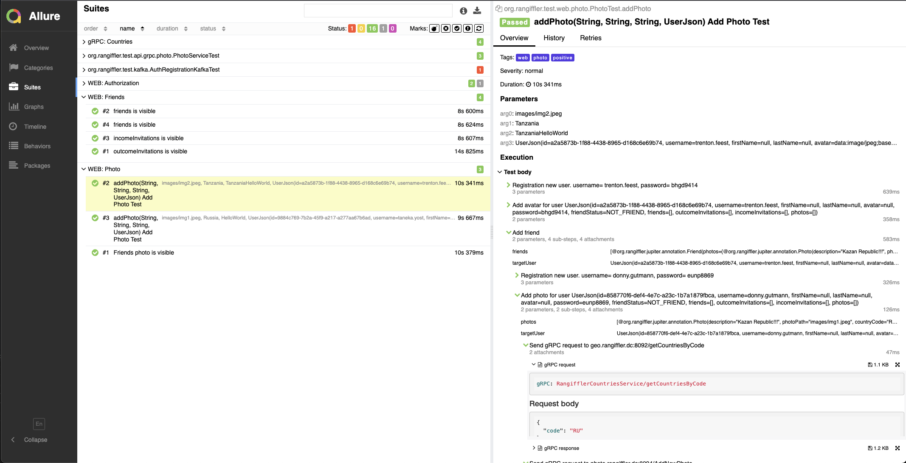

## **Rangiffler**


Кстати, Rangiffler - произошло от названия северных оленей - Rangifer. Мы выбрали именно такое
название для этого проекта - потому, что он про путешествия, а северный олень - рекордсмен по
преодолеваемым расстояниям на суше. Путешествуй, будь как Rangiffler!


**Минимальные предусловия для работы с проектом Rangiffler**

#### 1. Установить docker (Если не установлен)

Мы будем использовать docker для БД (MySql), кроме того, будем запускать микросервисы в едином docker network при
помощи docker-compose

[Установка на Windows](https://docs.docker.com/desktop/install/windows-install/)

[Установка на Mac](https://docs.docker.com/desktop/install/mac-install/) (Для ARM и Intel разные пакеты)

[Установка на Linux](https://docs.docker.com/desktop/install/linux-install/)

После установки и запуска docker daemon необходимо убедиться в работе команд docker, например `docker -v`:

```posh
MacBook-Pro ~ % docker -v
Docker version 20.10.14, build a224086
```

#### 2. Спуллить контейнер mysql, zookeeper и kafka версии 7.3.2

```posh
docker pull mysql:latest
docker pull confluentinc/cp-zookeeper:7.3.2
docker pull confluentinc/cp-kafka:7.3.2
```

После `pull` вы увидите спуленный image командой `docker images`

```posh
mitriis-MacBook-Pro ~ % docker images            
REPOSITORY                 TAG              IMAGE ID       CREATED         SIZE
mysql                      8.0.33           9f3ec01f884d   10 days ago     379MB
confluentinc/cp-kafka      7.3.2            db97697f6e28   12 months ago   457MB
confluentinc/cp-zookeeper  7.3.2            6fe5551964f5   7 years ago     451MB
```

#### 3. Создать volume для сохранения данных из БД в docker на вашем компьютере

```posh
docker volume create rangiffler_mysql
```

#### 4. Запустить БД командой

```posh
docker run --name rangiffler-all -p 3306:3306 -e MYSQL_ROOT_PASSWORD=secret -v rangiffler_mysql:/var/lib/postgresql/data -d mysql:latest

docker run --name=zookeeper -e ZOOKEEPER_CLIENT_PORT=2181 -e ZOOKEEPER_TICK_TIME=2000 -p 2181:2181 -d confluentinc/cp-zookeeper:7.3.2

Zookeeper_Server_IP=$(docker inspect zookeeper --format='{{ .NetworkSettings.IPAddress }}')

docker run --name=kafka -e KAFKA_BROKER_ID=1 \
-e KAFKA_ZOOKEEPER_CONNECT=${Zookeeper_Server_IP}:2181 \
-e KAFKA_ADVERTISED_LISTENERS=PLAINTEXT://localhost:9092 \
-e KAFKA_OFFSETS_TOPIC_REPLICATION_FACTOR=1 \
-e KAFKA_TRANSACTION_STATE_LOG_MIN_ISR=1 \
-e KAFKA_TRANSACTION_STATE_LOG_REPLICATION_FACTOR=1 \
-p 9092:9092 -d confluentinc/cp-kafka:7.3.2

```

#### 5. Установить одну из программ для визуальной работы с MySql

Например, DBeaver или Datagrip.


#### 7. Установить Java версии 17 или новее. Это необходимо, т.к. проект не поддерживает версии <17

Версию установленной Java необходимо проверить командой `java -version`

```posh
MacBook-Pro ~ % java -version
openjdk version "19.0.1" 2022-10-18
OpenJDK Runtime Environment Homebrew (build 19.0.1)
```

Если у вас несколько версий Java одновременно - то хотя бы одна из них должна быть 17+
Если java не установлена вовсе, то рекомендую установить OpenJDK (например, из https://adoptium.net/en-GB/)

#### 8. Установить пакетый менеджер для сборки front-end npm

[Инструкция](https://docs.npmjs.com/downloading-and-installing-node-js-and-npm).
Рекомендованная версия Node.js - 18.13.0 (LTS)

# Запуск Rangiffler локально в IDE:

#### 1. чтобы запустить фронтенд нужно перейти в каталог [rangiffler-client](..%2Frangiffler-client)


```posh
MacBook-Pro niffler % cd rangiffler-client
```


#### 2. Запустить фронтенд (сначала обновить зависимости)

```posh
MacBook-Pro niffler-frontend % npm i
MacBook-Pro niffler-frontend % npm run build:dev
```

#### 3. Прописать run конфигурацию для всех сервисов niffler-* - Active profiles local

Для этого зайти в меню Run -> Edit Configurations -> выбрать main класс -> указать Active profiles: local
[Инструкция](https://stackoverflow.com/questions/39738901/how-do-i-activate-a-spring-boot-profile-when-running-from-intellij).


#### 4 Запустить сервис Niffler-auth c помощью gradle или командой Run в IDE:
- 

- Запустить сервис auth

```posh
MacBook-Pro niffler % cd rangiffler-auth
MacBook-Pro niffler-auth % gradle bootRun --args='--spring.profiles.active=local'
```

Или просто перейдя к main-классу приложения NifflerAuthApplication[RangifflerAuthApplication.java](..%2Frangiffler-auth%2Fsrc%2Fmain%2Fjava%2Forg%2Frangiffler%2FRangifflerAuthApplication.java) выбрать run в IDEA (предварительно удостовериться что
выполнен предыдущий пункт)

#### 5 Запустить в любой последовательности другие сервисы: 
[rangiffler-photo](..%2Frangiffler-photo), [rangiffler-geo](..%2Frangiffler-geo), [rangiffler-gateway](..%2Frangiffler-gateway), [rangiffler-users](..%2Frangiffler-users)


#### 6 Запустить тесты: 
```posh
bash ./gradlew :rangiffler-e-2-e-tests:clean test -Dtest.env=local
bash ./gradlew :rangiffler-e-2-e-tests:allureServe
```

# Запуск Rangiffler в докере:

#### 1. Создать бесплатную учетную запись на https://hub.docker.com/ (если отсутствует)

#### 2. Создать в настройках своей учетной записи access_token

[Инструкция](https://docs.docker.com/docker-hub/access-tokens/).

#### 3. Выполнить docker login с созданным access_token (в инструкции это описано)

#### 4. Прописать в etc/hosts элиас для Docker-имени 
#### frontend:  127.0.0.1 frontend.rangiffler.dc, 
#### auth:      127.0.0.1 auth.rangiffler.dc
#### gateway:   127.0.0.1 gateway.rangiffler.dc

```posh
MacBook-Pro rangiffler % vi /etc/hosts
```

```posh
##
# Host Database
#
# localhost is used to configure the loopback interface
# when the system is booting.  Do not change this entry.
##
127.0.0.1       allure
127.0.0.1       frontend.rangiffler.dc
127.0.0.1       auth.rangiffler.dc
127.0.0.1       gateway.rangiffler.dc
```

#### 5. Перейти в корневой каталог проекта

```posh
MacBook-Pro rangiffler % cd rangiffler
```

#### 6. Запустить все сервисы:

```posh
MacBook-Pro  rangiffler % bash docker-compose-dev.sh
```


Rangiffler при запуске в докере будет работать для вас по адресу http:/frontend.rangiffler.dc:80/, этот порт НЕ НУЖНО указывать
в браузере, таким образом переходить напрямую по ссылке http://frontend.rangiffler/
*ВАЖНО!* из docker-network Вам будут доступны только следующие порты:

- порт 80 (все запросы с него перенаправляются nginx-ом на frontend)
- порт 9000 (сервис rangiffler-auth)
- порт 8080 (сервис rangiffler-gateway)


# Запустить все сервисы и тесты в докере:

```posh
MacBook-Pro  niffler % bash docker-compose-e2e.sh
```

#### 3. Selenoid UI доступен по адресу: http://localhost:9090/

#### 4. Allure доступен по адресу: http://localhost:5050/allure-docker-service/projects/rangiffler-e-2-e-tests/reports/latest/index.html


# Пример отчета Allure 


## **Технологии, использованные в Rangiffler**

- [Spring Authorization Server](https://spring.io/projects/spring-authorization-server)
- [Spring OAuth 2.0 Resource Server](https://docs.spring.io/spring-security/reference/servlet/oauth2/resource-server/index.html)
- [Spring data JPA](https://spring.io/projects/spring-data-jpa)
- [Spring Web](https://docs.spring.io/spring-framework/docs/current/reference/html/web.html#spring-web)
- [Spring gRPC by https://github.com/yidongnan](https://yidongnan.github.io/grpc-spring-boot-starter/en/server/getting-started.html)
- [Spring web-services](https://docs.spring.io/spring-ws/docs/current/reference/html/)
- [Docker](https://www.docker.com/resources/what-container/)
- [Docker-compose](https://docs.docker.com/compose/)
- [MySql](https://dev.mysql.com/doc/)
- [Apache Kafka](https://developer.confluent.io/quickstart/kafka-docker/)
- [JUnit 5 (Extensions, Resolvers, etc)](https://junit.org/junit5/docs/current/user-guide/)
- [Retrofit 2](https://square.github.io/retrofit/)
- [Allure](https://docs.qameta.io/allure/)
- [Selenide](https://selenide.org/)
- [Selenoid & Selenoid-UI](https://aerokube.com/selenoid/latest/)
- [Allure-docker-service](https://github.com/fescobar/allure-docker-service)
- [Java 17](https://www.oracle.com/java/technologies/javase/jdk17-archive-downloads.html)
- [Gradle 7.6](https://docs.gradle.org/7.6/release-notes.html)